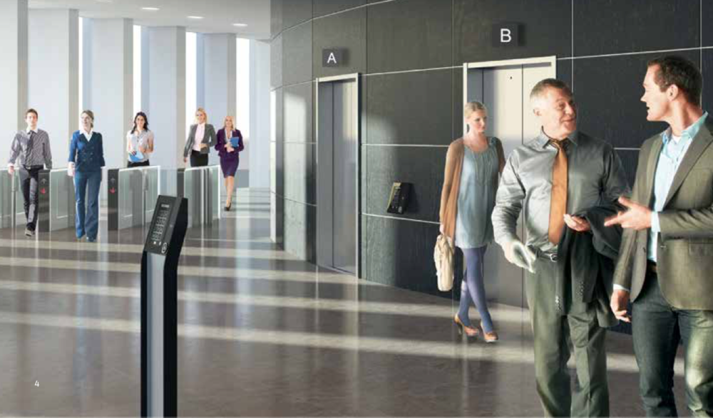

# Elevator Q / Iteration 1 

## See as a Product Manager

We'll use a **Destination dispatch** elevator control system.  

> Destination dispatch is an optimization technique used for multi-elevator installations, which groups passengers for the same destinations into the same elevators, thereby reducing waiting and travel times when compared to a traditional system where all passenger wishing to ascend or descend enter the same elevator and then request their destination. 

 
Please read more about it : [here on elevation.fandom.com](https://elevation.fandom.com/wiki/Destination_dispatch).

  

*ref: a dispatch system in a business building*

But we'll use a mix wide test case instead of only business uses as in an entreprise building. 
We'll focus on a fleet of elevators inside an hotel.   
Go to **the Marriott Marquis midtown** (NYC/Broadway), and make a mixing of Professional, Personal and Leisure use cases.

We'll divide our system in two essential parts : the hotel setup (dispatch controller) and the people experience (ux).

Of course, every building/hotel is different. Here's the case of the Mariott we should build now.

### dispatch controller 

**1) physical building setup**

Info | Values | More |
--- | --- | -- |
| nb of floors | 47 |
| roof | 47 |  **the view restaurant** :  [have a look in images](https://www.google.com/search?q=marriott+marquis+the+view+restaurant&tbm=isch) If the project is sucessfull, we go and book !|
| rooms | 46 to 5 | hotel rooms |
| meeting | 4 to 1 | convention center |
| lobby | 0 | public entrance |
| nb of elevators | 6 |
| elevators name | A, B, C, D, E, F |

**2) elevator dispatch versionning**

By elevator dispatch, it's how to say which elevator is assign to witch group of floors.
And it's necessary to have a versionning of a setup, as it can change on daily time, with public influence.

Who change ? Cron, building manager, captors... More to expect.

We group elevators from people needs and uses and time :
- daylight version 
  - direct roof : the view
  - first floors and meeting only
  - rooms only
- night version :
  - direct roof : the view
  - rooms only 
  - rooms only and roof from rooms
- specific event version :
  - direct roof : the view
  - event meeting floor and rooms 
  - rooms only and roof from rooms
  

### user experience
 1) mulitple main touch system 5 meters in front

 2) less secondary touch system near the elevators

 3) waiting or dispatch message

 4) see elevators movements and status

 5) extra 

     - scan your marriott id card to get access to your direct room floor
     - meetings screens : select to go to your elevator
 

 ## See as an Engineer

### learn from others

- Destination dispatch | Elevator Wiki | Fandom  
https://elevation.fandom.com/wiki/Destination_dispatch

- Elevator System Design | Object Oriented System Design Interview Question - YouTube  
  https://www.youtube.com/watch?v=siqiJAJWUVg

- Optimization of Elevator Dispatching by Using Genetic Algorithm in Python - Elevator World   
https://elevatorworld.com/article/optimization-of-elevator-dispatching-by-using-genetic-algorithm-in-python/

- The k-Nearest Neighbors (kNN) Algorithm in Python – Real Python  
 https://realpython.com/knn-python/
- LOOK Disk Scheduling Algorithm - GeeksforGeeks
 https://www.geeksforgeeks.org/look-disk-scheduling-algorithm/
 - What algorithm is used by elevators to find the shortest path to travel floor orders? - Software Engineering Stack Exchange
  https://softwareengineering.stackexchange.com/questions/331692/what-algorithm-is-used-by-elevators-to-find-the-shortest-path-to-travel-floor-or
- opensource (plain python) 
https://github.com/ngautam0/elevator-system
- opensource (python + django)
  https://github.com/avpps/elevator_group_simulator
-

