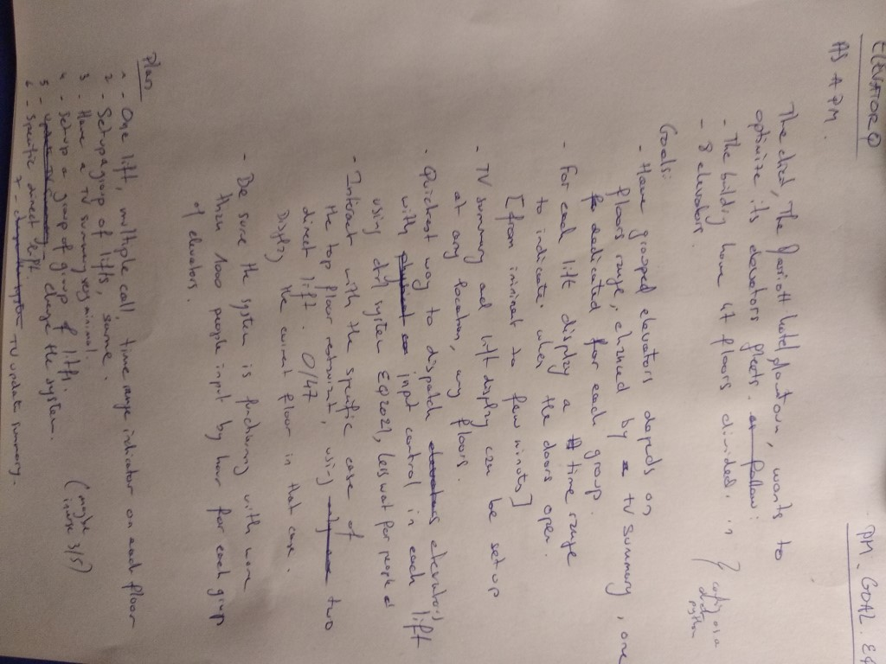
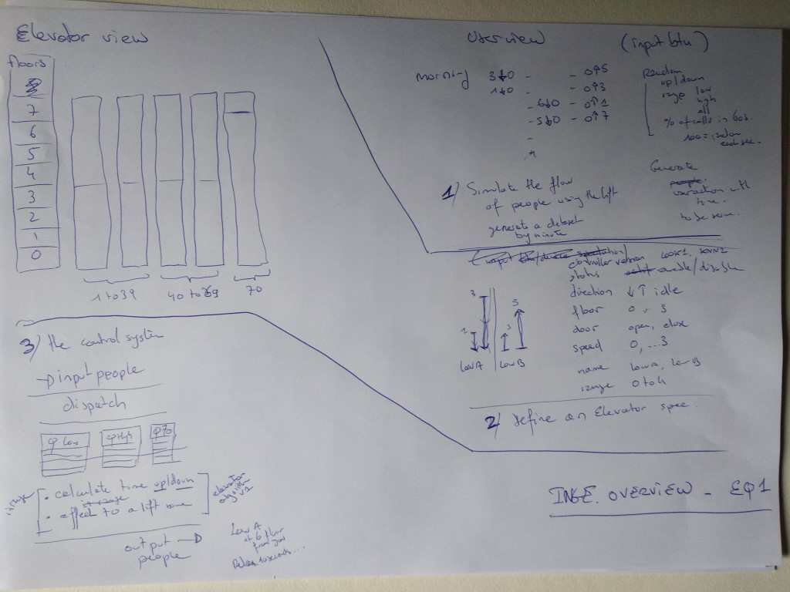
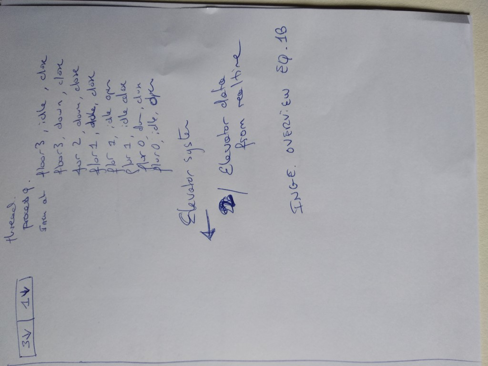
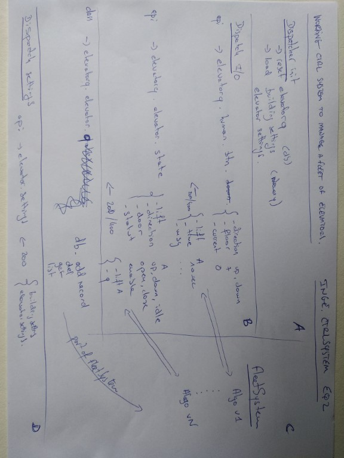
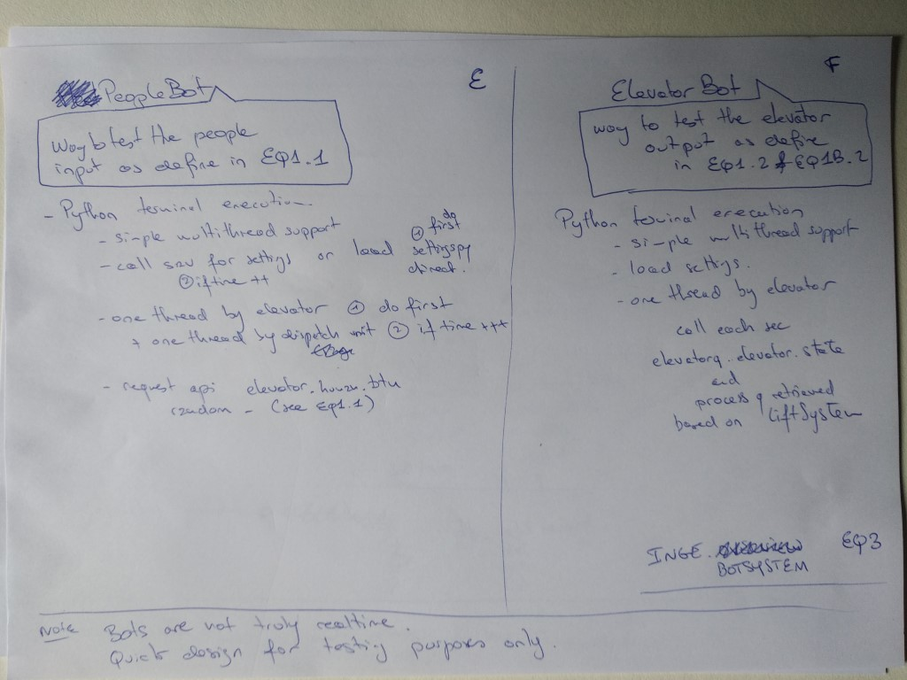
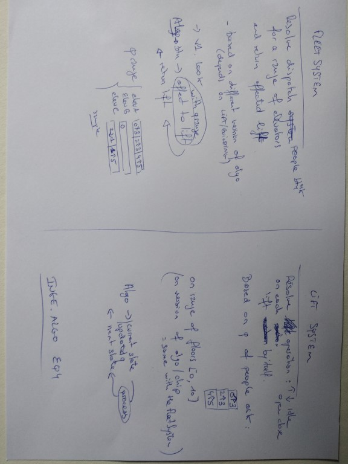

# Elevator Q / Iteration 2

---

## Product Manager

| Handwriting                 | Text                                                                                                                                          |
| --------------------------- | --------------------------------------------------------------------------------------------------------------------------------------------- |
|  | **PM_EQ2.**  Define the goals and the incremental steps, after engineering meeting. Redefine the goals with a LOOK / Monitoring interface. |

## Engineer

| Handwriting                            | Text                                                                                                    |
| -------------------------------------- | ------------------------------------------------------------------------------------------------------- |
|      | **ENGI_EQ1.** 1) User view 2) Define an elevator spec 3) The control system                    |
|  | **ENGI_EQ1B**  Sample data for elevator spec ENGI_EQ1_2.                                             |
|   | **ENGI_EQ2.**  1) Dispatch init and settings,  2) Dispatch I/O,  3) Fleet System,              |
|     | **ENGI_EQ3.**  1) PeopleBot to simulate people flow  2) Elevator Bot to simulate elevator system. |
|          | **ENGI_EQ4.**  1) Fleet system,  2) Elevator system.                                              |
