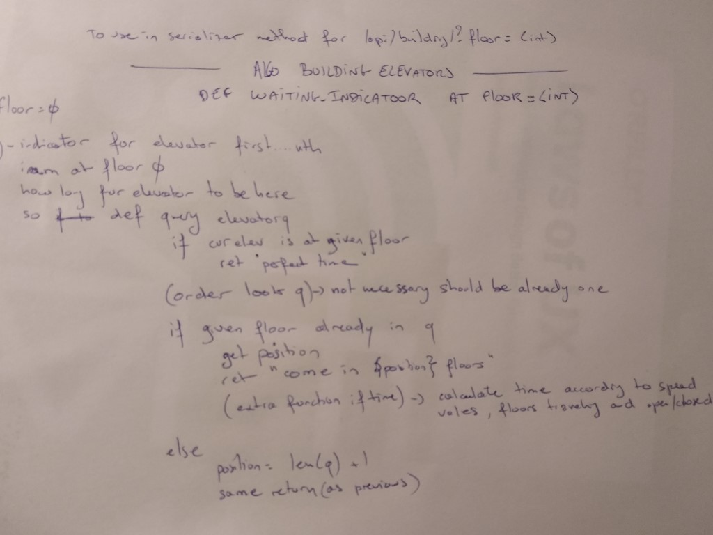

# Elevator Q / Iteration 3 / v1.1

We simplify our [first](../iter1/readme.md) and [second](../iter2/readme.md) design thinking iteration, and focus on the result we want : optimize UX, keep the LOOK algorithm, fixed use cases for the elevators fleet.

_Last documentation update : 24 may 2021_

---

**[Go for an online demo : elevatorq.herokuapp.com](http://elevatorq.herokuapp.com)**

-   to login the admin : user _**admin**_, pwd _**admin**_
-   _might take a little time to load at the first access_

---

[[_TOC_]]

---

## Goals UX for Elevator Q

### Clarity : people input and system display

1. INPUT_FIXED_CASES :  
   Demonstration interface focused on **fixed use cases** :  
   Have a dataset of people who press the elevator button, depart floor to arrival floor

```
ex: Floor 0 to Floor 17, Floor 3 to Floor 0, etc...
```

2. RESPONSE_ELEVATOR_NAME,
3. RESPONSE_WAITING_INDICATOR :  
   After running people use case, immediate transition (or waiting indicator if needed) to **display the elevator name dispatched** to this travel, with a **waiting indicator before door open** at people floor.

```
ex: Elevator A has 10 floors, 2 stops before arrival
ex: Elevator A arrival very soon/in a minute/is long sorry...
```

4. DISPLAY_ELEVATORQ,
5. BEAT_ELEVATORQ_ONOFF :  
   Demonstration interface **display the elevator queue**, as an independant monitoring system, with an **on/off toggle** the start or shutdown the system.

```
ex: start the beat / simulate the elevator system
ex: direct stop or bring all elevators to last case and stop
```

### Performance : people waits and people lifted

6. RESPONSE_WAITING_INDICATOR (already saw)
7. CONTROL_SYSTEM : Use the distributed server django api and the look algorithm.

## Application and directory structure

| Apps               |                                                     |
| ------------------ | --------------------------------------------------- |
| ...                | misc files for project settings                     |
| docs               | thoses readme                                       |
| **elevatorq**      | backend app : orm, admin                            |
| **elevatorq.api**  | rest api for the front                              |
| **elevatorq.algo** | elevator fleet alogrithms                           |
| **elevatorq_ui**   | frontend app ( vitejs, vue3 )                       |
| sandbox            | code for personnal testing                          |
| **server**         | django server settings                              |
| staticfiles        | django package staticfiles, automatically generated |

We use :

-   **django** as backend orm, http and api server
-   **vite/vuejs/bootstrap5** as front interface
-   **heroku** as deployed container with standard sqllite/static : online data are erased at each deploy
-   **mypy** for python typing

In future :

-   add pytest
-   convert javascript to typescript
-   add jest, cypress

## Coding days

### Before the coding days

#### a) Think about the project as Product Manager and an Engineer

-   do sketches
-   design thinking
-   build thinking
-   read the thinking with the constraints and the objectives
-   iterate again if needed

#### b) Do some python exercises

-   LOOK from the net : make it work
-   FLEET : just get a look...
-   MODEL : create raw python model and validation for people input

#### c) Setup the application and do some front exercises

-   install django ecosystem
-   install vite/vuejs ecosystem
-   create bootstrap starting template
-   connect django and vite
-   deploy on online cloud - this case : heroku

### Part 1 : the datas

1. Create the orm : [elevatorq.models](../../elevatorq/models.py)

-   `PressBtnQ`
-   `ElevatorQ`
-   `BuildingElevator`

2. Setup the admin : [elevatorq.admin](../../elevatorq/admin.py)
3. Create the api : [elevatorq.api.urls](../../elevatorq/api/urls.py)

-   `/api/pressbtnq/`
-   `/api/elevatorq/`
-   `/api/building/`

4. Update navbar of the front : [elevatorq_ui](../../elevatorq_ui/readme.md)

### Part 2 : the algo (1/3)

Start to create the algo system starting by the `PressBtn` scope...

1. Algo input and dispatch : [elevatorq.algo.eq](../../elevatorq/algo/eq.py)

### Part 3 : the algo (2/3)

Start to create test data by the `BuildingElevators` scope...

1. `FlagSystem` : Manage records attributs in ElevatorQ Database
    1. ``enable_elevators_at_lobby_floor()`
    2. `reset_pressbtn_q()`
    3. `reset_elevator_q()`
2. `ResetDatabase` : Inherit from `FlagSystem` + Reset database for demonstration and testing purpose
    1. `reset`
    2. `fill_elevator_q`
3. `DispatchSystem` : dispatch actions to elevators
    1. affect*elevator : \_TODO*
    2. scan*pressbtn_q : \_TODO*
    3. add*btn_code : \_TODO*
    4. calculate*waiting_indicator : \_TODO*
    5. `display_elevator_q` : display data for all elevators
4. The algo system defined in elevatorq.appsettings and in the `BuildingElevator` model
    1. choose between LOOK and DIRECT

Setup

```
# Elevator Algorithm
# support different algorithm by building elevator

# Use standard LOOK algorithm to order the floor stops
EQ_ALGO_LOOK = "elevatorq.algo.look"

# Use start_floor <-> final_floor without stoping floors between
EQ_ALGO_DIRECT = "elevatorq.algo.direct"

# Choices available in models
EQ_ALGO = (
    (EQ_ALGO_LOOK, "LOOK System"),
    (EQ_ALGO_DIRECT, "DIRECT System"),
)
EQ_DEFAULT_ALGO = EQ_ALGO_LOOK
```

How to test :

```
# elevatorq.algo
>>> python algo.py
```

```
Django setup ok
.................fill_elevator_q..................ResetDatabase
Find 5 elevator(s)
start_floor 34 direction DOWN final_floor 0
start_floor 3 direction DOWN final_floor 0
start_floor 30 direction DOWN final_floor 0
start_floor 34 direction DOWN final_floor 0
start_floor 0 direction UP final_floor 47
.................fill_elevator_q..................ResetDatabase
Find 5 elevator(s)
start_floor 31 direction DOWN final_floor 0
start_floor 0 direction UP final_floor 20
start_floor 33 direction DOWN final_floor 0
start_floor 0 direction UP final_floor 13
start_floor 47 direction DOWN final_floor 0
.................fill_elevator_q..................ResetDatabase
Find 5 elevator(s)
start_floor 0 direction UP final_floor 24
start_floor 14 direction DOWN final_floor 0
start_floor 33 direction DOWN final_floor 0
start_floor 0 direction UP final_floor 37
start_floor 47 direction DOWN final_floor 0
................display_elevator_q................DispatchSystem
Elevator A q : [0, 24, 34, 31] : <QuerySet [34, 0, 31, 0, 0, 24]>
Elevator B q : [0, 3, 20, 14] : <QuerySet [3, 0, 0, 20, 14, 0]>
Elevator C q : [0, 33, 30] : <QuerySet [30, 0, 33, 0, 33, 0]>
Elevator D q : [0, 34, 37, 13] : <QuerySet [34, 0, 0, 13, 0, 37]>
Elevator THE_VIEW q : [0, 47] : <QuerySet [0, 47, 47, 0, 47, 0]>
```

### Part 4 : the front

1. Add lobby elevator control summary
2. Update the components architecture with a store
3. Connect with `/api/building/`
4. Manage errors as alerts
5. Prepare `pressbtnq` and `elevatorq` display

### Part 5 : the algo (3/3)

to be continued...

## Sketches

### Design thinking

| User interface            | Elevators Administration  |
| ------------------------- | ------------------------- |
|  |  |
|  |                           |

### Build thinking

| Data                    | Algorithm               |
| ----------------------- | ----------------------- |
|  |  |
|                         |  |

## More about the frontend interface

Made with Vite and Vue3 - Javascript

```
elevatorq_ui
```

| Apps                         |                                                              |
| ---------------------------- | ------------------------------------------------------------ |
| dist                         | build ui from `yarn build` served by django - connected to a template view and a assets static storage |
| public                       | favicon - duplicate with django server faveico in static     |
| **src**                      | vue3 application                                             |
| src.assets                   | images sent to dist\assets (served by django)                |
| **src.components**           | components with plain bootstrap html                         |
| **src.components.elevatorq** | specific components connected with the store - elevator summary for the moment |
| src.json                     | mock json resturn if api failed or for initial build         |
| **src.store**                | basic store                                                  |
| **src.store.elevatorq**      | fetch the /api/building/                                     |
| src.utils                    | server to call with fetching                                 |
| **index.html**               | home                                                         |
| .env                         | dev environment                                              |

## Build and deploy

### django as backend

run django server

```
python manage.py runserver 127.0.0.1:81 (or 8000 by default)
```

### vite as frontend

run vite server for dev

```
elevatorq_ui\yarn dev (no connection with django)
```

build vite frontend to be served by django

```
elevatorq_ui\yarn build (keep the dist directory and use to serve asserts and template in django)
```

make django default url to elevatorq_ui\dist\index.html

### deploy on heroku

collectstatic if packages updated before deploy

```
python manage.py collectstatic
```

deploy on elevatorq.herokuapp.com

```
git push heroku
```

## Changelog

v1.0 : initial release for coding challenge (21 may)

v1.1 : build and design enhancement (24 may)
